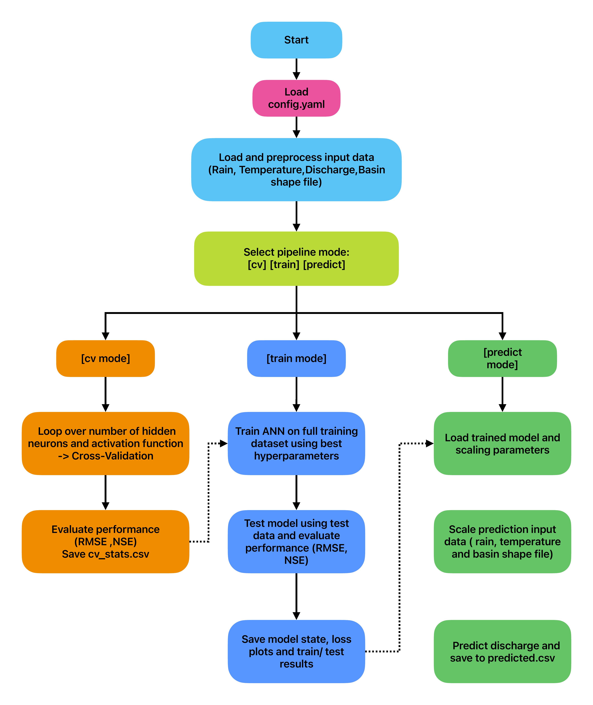
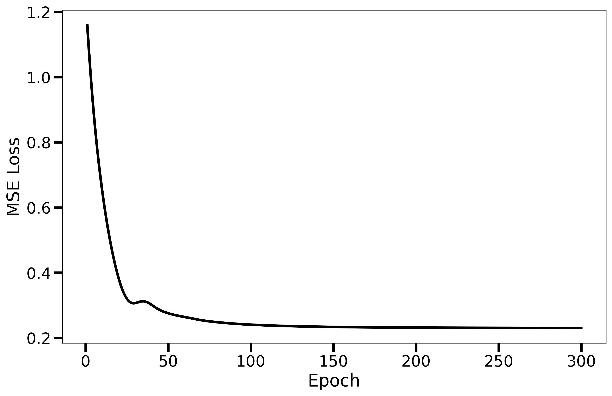

# ANN Hydrology Model Pipeline

This repository contains an Artificial Neural Network (ANN) based hydrology model pipeline consisting of three main stages:

- Cross-validation (`cv`)
- Full training (`train`)
- Prediction (`predict`)

Each stage uses separate scripts modularized and orchestrated via `main.py`.


---

## Table of Contents

- [Overview](#overview)
- [Skills Demonstarted](#skills-demonstarted)
- [Installation](#installation)
- [Usage](#usage)
- [Configuration](#configuration)
- [Input Data Requirements](#input-data-requirements)
- [Outputs](#outputs)
- [Logging and Error Handling](#logging-and-error-handling)
- [Sample Results](#sample-results)
- [Data Sources](#data-sources)

---

## Overview

This pipeline preprocesses rain and maximum temperature data, trains ANN models for river basin discharge response at the mouth of the basin, and produces the basin wide response to rain. The pipeline supports configurable cross-validation, full training, and prediction modes. This model only works for large basins where the monthly discharge response depends on the present month rain and the prior month rain.

<p align="center">
  
</p>

<p align="center"><em>Figure 1: Schematic representation of the pipeline (Dashed arrows represent logical path for the activation of each mode).</em></p>

---
## Skills Demonstrated

- Time-series data preprocessing (NetCDF and shapefiles)
- Artificial Neural Network (ANN) modeling for hydrological prediction
- Cross-validation and hyperparameter tuning
- Model training and evaluation using statistical metrics (RMSE, NSE)
- Z-score normalization and scaling management
- Modular Python development with structured config-based execution
- Logging, error handling, and reproducible results
- Result visualization and automated plotting (Matplotlib/Seaborn)
- Use of domain knowledge to design ANN input features (e.g., using present and prior rainfall)
- Integration of geospatial data (basin shapefiles) with machine learning workflows
---

## Installation

1. Clone the repository:
    ```bash
    git clone https://github.com/sayan-geoDL/large-basin-ann-rain-response-pipeline
    cd large-basin-ann-rain-response-pipeline
    ```

2. (Optional) Create and activate a virtual environment:
    ```bash
    python -m venv venv
    source venv/bin/activate  # Linux/macOS
    venv\Scripts\activate     # Windows
    ```

3. Install required Python packages:
    ```bash
    pip install -r requirements.txt
    ```

---

## Usage

Run the pipeline via the command line by specifying a config file and mode:

```bash
python main.py --config config.yaml --mode [cv|train|predict]
```
## Configuration
The pipeline requires a config.yaml file to specify input data paths, training parameters, and output directories.

Below is a sample structure of config.yaml:
```
data:
  temperature_train: "path/to/temperature_train.nc"
  rain_train: "path/to/rain_train.nc"
  shape_file: "path/to/shapefile.shp"
  discharge_train: "path/to/rain_predict.nc"
  temperature_predict: "path/to/temperature_predict.nc"
  rain_predict: "path/to/rain_predict.nc"

cross_validation:
  train_time: ["YYYY-MM-DD"/"YYYY", "YYYY-MM-DD"/"YYYY"]
  months: [M1,M2,...]
  activation_function: 'logsigmoid'
  neuron_list: [1,2,4,5,6,8,12,32]
  epochs: 300
  learning_rate: 0.01
  weight_decay: 0.001
  save_fig: False
full_train:
  activation_function: 'logsigmoid'
  hidden_neuron: 6
  epochs: 300
  learning_rate: 0.01
  weight_decay: 0.001
  train_time: ["YYYY-MM-DD"/"YYYY", "YYYY-MM-DD"/"YYYY"]
  test_time: ["YYYY-MM-DD"/"YYYY", "YYYY-MM-DD"/"YYYY"]
  months: [6,10]
  
prediction :
  predict_time: ["YYYY-MM-DD"/"YYYY", "YYYY-MM-DD"/"YYYY"]
output:
  out_dir: ./out
  cv_results_dir: "./out"
  train_dir: "./out"
  stat_dir: "./out"
  model_dir: "./out"
  predict_dir: "./out"
  plots_dir: "./plots"
```
### Notes
- You can try different values of `learning_rate` and `weight_decay` in cv mode.

- Modify `neuron_list` to experiment with different neuron counts.

- If `weight_decay` is set to None, L2 regularization is disabled.

- The `activation_function` supports only a limited set of predefined function
  - `'relu'`
  - `'sigmoid'`
  - `'tanh'`
  - `'logsigmoid'`
  - `'leakyrelu'`
  - `'gelu'`
- The model only considers Rainfall and Maximum temperature data and not the Dams activity, which largely effects most large basins, so be careful to include months which exhibit high rainfall in the region like monsoon time. During high rainfall period the effect of Dams are often negligible.

## Input Data Requirements

The pipeline expects the following inputs in NetCDF and shapefile formats:

1. Rainfall Data

- Format: .nc
- Dimensions: (time,latitude,longitude)
- Temporal coverage: Must contain atleast one month of data  prior to the target discharge period

2. Maximum Temperature data

- Format: .nc
- Dimensions: (time,latitude,longitude)
- Temporal coverage: Only needs to be of equal length to the discharge period

3. Observed Discharge
- Format: .nc
- Dimensions: (time,)
- Temporal coverage: Must align with Temperature data

4. Shapefile

- Format: .shp + accompanying .dbf, .shx, .prj
- CRS: Must match NetCDF data
- Description: Polygon of the basin boundary

General Notes

- All input data must be preprocessed to handle missing values appropriately. Ensure that there are no NaNs or masked values in the relevant time and spatial extent.
- Units and variable names in NetCDF files need not follow standard conventions but must contain only one variable, not more than that.
- All input data needs to be stored in the ./data directory
## Outputs

1. Cross Validation (cv) Mode

- Performance statistics for different combinations of Hyperparameters and neurons
- Root Mean Square Error (rmse) and Nash-Sutcliffe Efficiency (nse) values for each number of neurons stored in `./out/cv_stats.csv` for individual learning rate , weight decay and activation function
- If save_fig: True is set in the config.yaml, training and validation loss curves are saved to the `./plots` directory.

2. Full Training (train) Mode

- Retrains the ANN model using the entire training dataset based on the best hyperparameters selected from cross-validation.
- Outputs include:
  - Predicted vs. observed discharge time series along with RMSE and NSE scores:
    - Training period: `./out/train.csv`
    - Testing period: `./out/test.csv`
    - Combined: `./out/train_test.csv`
- Scaling parameters used for z-score normalization (mean and standard deviation) saved to:
  `./out/scaling_parameter.csv`
  (These are required for consistent scaling during prediction.)
- Trained model state saved as:
  `./out/model_state.pth`
  (This is necessary for use in prediction mode.)
- The Loss curve is saved as `./plots/train_test_loss.png`
- Time series plot of observed vs. predicted discharge for training and testing periods.
    (Saved as `./plots/train_test_plot.png`)

3. Prediction (predict) mode

- Predicted discharge time series saved as `.out/predicted.csv`.

General notes

- Before running the the predict mode the training mode needs to be run atleast once to save the model state
- A z- score scaling is used for this work instead of min max scaling on purpose, so that the extreme events don't dictate the learning of the ANN

## Logging and Error Handling
- The pipeline uses Python’s built-in logging module to record runtime information, warnings, and errors.

- Logs provide detailed progress updates for each pipeline stage (cv, train, predict) and help with troubleshooting.

- Log messages include timestamps and log levels (INFO, WARNING, ERROR).

- If an error occurs, the pipeline outputs meaningful messages and exits gracefully to avoid corrupted outputs.

- Logs are saved to ./main.log , making it easy to review pipeline execution details.


## Sample Results
<h2 id="sample-results">📊 Sample Results</h2>

<p align="center">
  
</p>

<p align="center"><em>Figure 2: MSE loss curve for the training period.</em></p>

<p align="center">
  
</p>

<p align="center"><em>Figure 3: Predicted vs Actual Discharge for training and testing periods.</em></p>

## Data Sources

This project uses rainfall, temperature, and discharge datasets for testing and demonstration. Due to licensing or distribution restrictions, the actual data files are **not included** in the repository.

### Referenced Datasets

- **Rainfall Data**  
  Source: [India Meteorological Department (IMD)](https://mausam.imd.gov.in/)  
  Format: Daily gridded NetCDF  
  Access: Institutional access required; data not openly redistributable.

- **Temperature Data**  
  Source: [IMD Maximum Temperature Data](https://mausam.imd.gov.in/)  
  Format: Daily gridded NetCDF  
  Note: Requires registration for download.

- **Observed Discharge Data**  
  Source: [Global Runoff Data Centre (GRDC)](https://grdc.bafg.de/data/data_portal/)
  Access: Available upon request.
- **Basin Shapefile**
  The basin shapefile used in this project was created by the author specifically for this analysis using publicly available GIS data. Due to project-specific customization, it is not shared in this
  repository.
  If you wish to reproduce the results, you may:
- Create your own basin shapefile using tools like QGIS, HydroSHEDS, or shapefiles from local authorities.
- Or contact the author for more details on how the shapefile was generated.

If you are running the pipeline, you must obtain similar data from the above sources or use your own datasets in the expected format.

